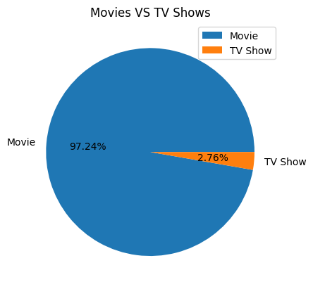
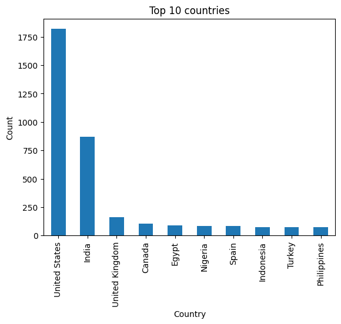
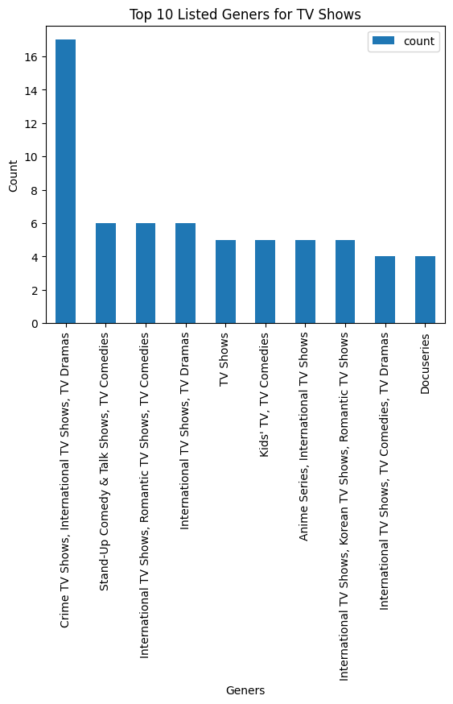
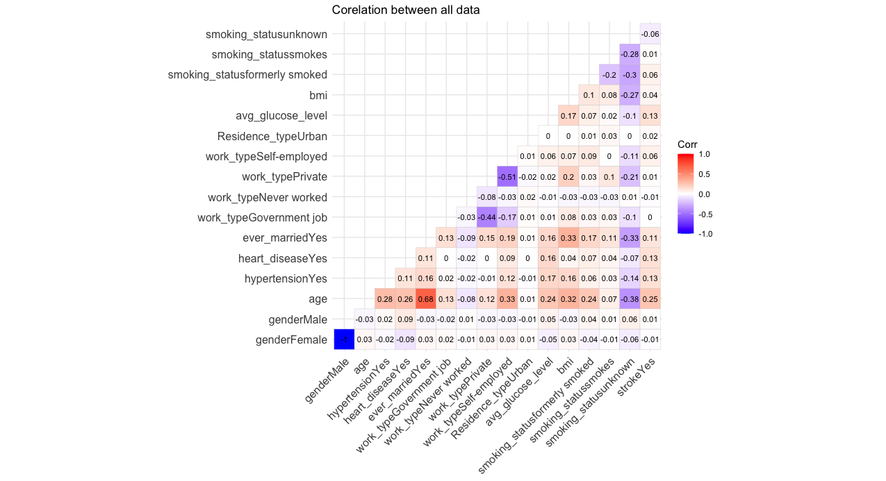
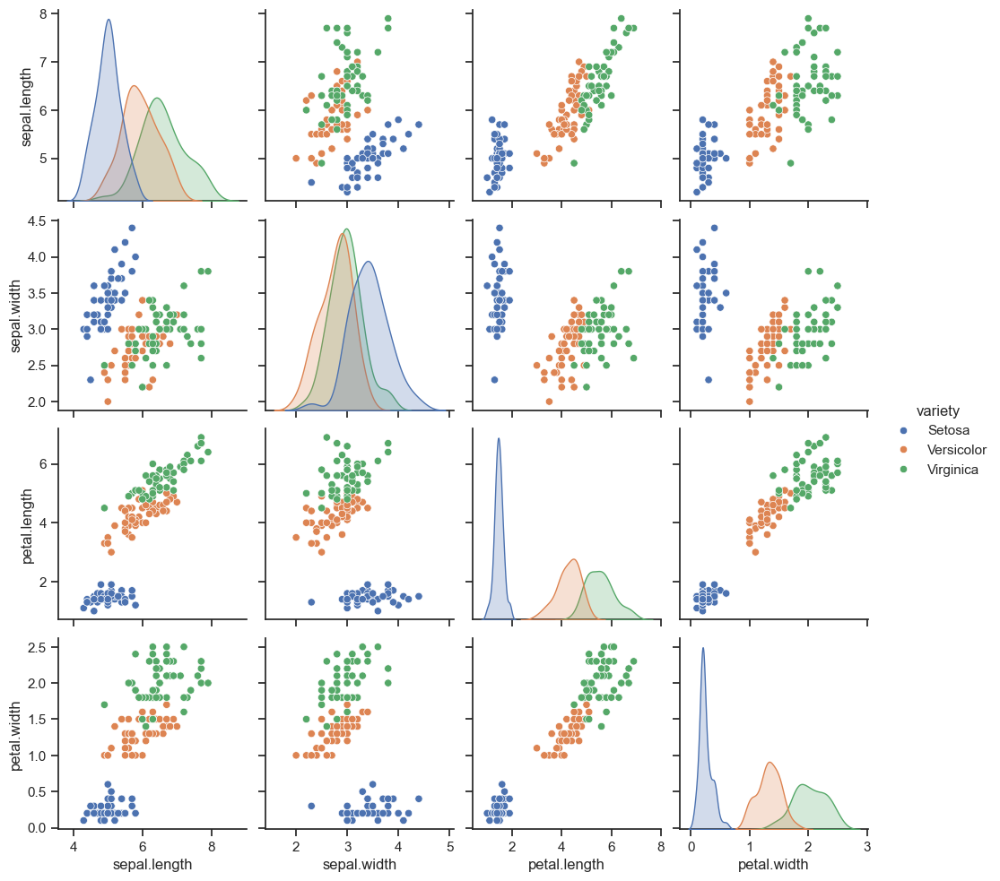
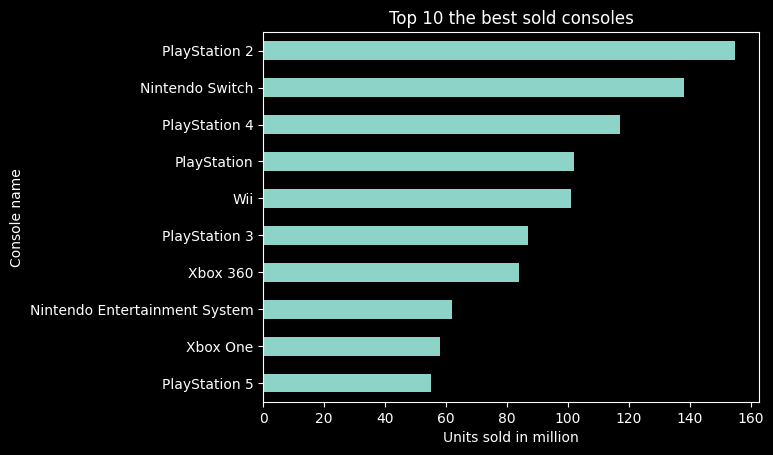
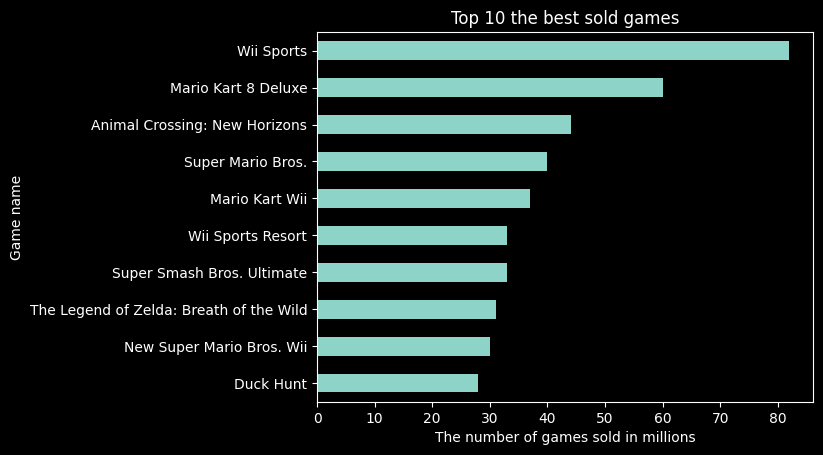

My example data analyst projects

# [Project 1: Netflix-Movies-and-TV-Shows](https://github.com/Gdyczko/Netflix_Movies_and_TV_Shows/tree/main)

Netflix is one of the most popular media and video streaming platforms. They have over 8000 movies or tv shows available on their platform, as of mid-2021, they have over 200M Subscribers globally. This tabular dataset consists of listings of all the movies and tv shows available on Netflix, along with details such as - cast, directors, ratings, release year, duration, etc.

## The dataset was analyzed in terms of:
1. **How many movies and TV shows have been published on the Netflix platform?**
2. **Movies and TV shows with the most published directors?**
3. **From which countries are the most movies published?**
4. **Which production years have the most movies on the Netflix platform?**
5. **In which age group are the most movies and TV shows published?**
6. **What is the most common duration of movies published on the Netflix platform?**
7. **How many seasons do TV shows most frequently have?**
8. **Which category has the most movies on Netflix?**
9. **Which category has the most TV shows on Netflix?**





# [Project 2: Stroke Data Analysis](https://github.com/Gdyczko/Stroke-Data_Analysis)
* The acquired dataset underwent analysis to determine whether there are any factors influencing the increased risk of stroke.
* Additionally, the BMI index among study participants was analyzed to check if the place of residence or type of work has an impact on this indicator.



# [Project 3: Create Cinema Database](https://github.com/Gdyczko/Create_Cinema_Database)

Description of the database:

The database has been created for the purpose of analyzing and efficiently managing the business of a cinema. It collects information about movies and their genres, directors, sold tickets, types of halls, as well as employees and their leaves. This enables us to possess and analyze various pieces of information, such as which type of movie (genre) is most frequently watched, whether the duration of the film matters in the selection process, whether the director's surname matters, which employee sells the most tickets, in which hall the most movies have been screened, etc. In general, with the help of this database, we are able to determine the level of cinema functioning, as well as better understand the needs of customers and adjust the services provided accordingly to their needs.
```sql
CREATE TABLE Movies (
    Movie_Id INT PRIMARY KEY,
    Title VARCHAR(50) NOT NULL,
    Duration TIME,
    Release_Date DATE,
    Screening_Start_Date DATE,
    Screening_End_Date DATE
)
```
# [Project 4: Machine Learning project](https://github.com/Gdyczko/ML_iris)
In this project, I am attempting to create a machine learning model capable of recognizing different types of iris flowers based on their sepal and petal lengths and widths.



* At first, I split the column "variety" because this value is what the machine learning model will try to predict. 

* Next the data is divided into training and testing sets in proportions of 80% to 20%.

* I load the data into the machine learning model. In this case I used Decision Tree Classifier

* Finally, we check the level of prediction accuracy.

```python
# Import library to split data
from sklearn.model_selection import train_test_split

# Split column "Variety"
y = iris.pop("variety")
y = list(y)
iris.head()

# Split random data for training and testing
X_train, X_test, y_train, y_test  = train_test_split(iris, y, test_size=0.2)

# Import Decision Tree Classifier 
from sklearn.tree import DecisionTreeClassifier
decision_tree = DecisionTreeClassifier()
decision_tree.fit(X_train, y_train)
y_predicted = decision_tree.predict(X_test)

# Check corect score predict
from sklearn.metrics import accuracy_score
score = accuracy_score(y_test, y_predicted)
score
```

The score is above 96% 

# [Project 5: SQL + Python - Console and Gaming sales](https://github.com/Gdyczko/Home_console_and_gaming_sales)
The database contains information about games and consoles.\
In the games database, there is information such as: game titles, the system they were created for, the number of units sold, the publisher, the game developer, release date, and a link to an image.\
In the console data database, there is information about: console names, their type, generation, production year, end of production date, number of consoles sold, additional information about the console, or links to gifs.

## Background
A SQL database was created based on two CSV files. The CSV files have been modified in Python for better data analysis.\
Detailed information regarding data modifications has been included in the [Data](Data) folder, while information regarding the creation of the database and tables, as well as loading the database, can be found in the [MSSQL_create_database](MSSQL_create_database) folder.

## The dataset was analyzed in terms of:
1. **Top 10 Sold Consoles**
2. **Top 10 Sold Games**
3. **Analysis of Console Popularity by Generation**
4. **Games Publisher Analysis**
5. **Games Developer Analysis**
6. **Publishing Trends Analysis**
7. **Market Analysis of Games by Console Type**
8. **Console Lifecycle Analysis**
9. **Top-Selling Games for a Specific Console**
10. **Analysis of Average Game Unit Sales by System**
11. **Average Sales of a Console in One Year**
12. **Best-Selling Game for a Specific Console**

## Top 10 the best sold consoles
The following query, after execution, will display a table of the top 10 consoles sold the most. The columns will contain information about the console name and the number of units sold in millions.\
This query was implemented in Python to create a chart displayed below the query.

```sql
SELECT TOP 10 
    Console_Name,
    Units_sold_in_million
FROM 
    Console
ORDER BY 
    Units_sold_in_million DESC
```



From the analyses abowe, we can infer that:
* The most units were sold for the PlayStation 2 console - 155 million units.
* The PlayStation 5 console ranked 10th, with 55 million units sold.
* All consoles from Sony (PlayStation) are in the top 10.
* Three consoles are from Nintendo (Wii / Nintendo).
* Only two consoles are from Microsoft (Xbox).

## Top 10 the best sold games
The following query, after execution, will display a table of the top 10 games sold the most. The columns will contain information about the games name and the number of units sold in millions.\
This query was implemented in Python to create a chart displayed below the query.

```sql
SELECT TOP 10 
    Game_Name,
    Units_m
FROM 
    Games
ORDER BY 
    Units_m DESC
```

 

```sql
SELECT TOP 10
    Game_Name,
    System_Full,
    Units_m
FROM
    Games
ORDER BY
    Units_m DESC
```


| Game Name                          | System Full                      | Units (millions) |
|------------------------------------|----------------------------------|------------------|
| Wii Sports                         | Wii                              | 82.9             |
| Mario Kart 8 Deluxe                | Nintendo Switch                  | 60.58            |
| Animal Crossing: New Horizons      | Nintendo Switch                  | 44.79            |
| Super Mario Bros.                  | Nintendo Entertainment System    | 40.24            |
| Mario Kart Wii                     | Wii                              | 37.38            |
| Super Smash Bros. Ultimate         | Nintendo Switch                  | 33.67            |
| Wii Sports Resort                  | Wii                              | 33.14            |
| The Legend of Zelda: Breath of the Wild | Nintendo Switch             | 31.61            |
| New Super Mario Bros. Wii          | Wii                              | 30.32            |
| Duck Hunt                          | Nintendo Entertainment System    | 28.31            |


From the analyses abowe, we can infer that:
* In the top 10, only games created for Nintendo consoles were included.
* The game Wii Sports has a significant lead in the number of units sold, with over 80 million units.
* Four games in the top 10 are associated with the Mario universe.
